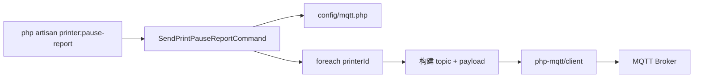

# MQTT 打印机 Pause 上报 Artisan 命令

## 目标

实现 `php artisan printer:pause-report`，向 topic：

```
anycubic/anycubicCloud/v1/printer/public/{userId}/{printerId}/print/report
```

发送固定格式的 pause 消息。支持一次命令向**多个打印机**各发一条消息。

## 命令签名（建议）

```bash
php artisan printer:pause-report \
  --printer=93d16fe4aa106b2d31e2abf931b1ce62 \
  --printer=anotherPrinterId \
  --taskid=245176 \
  --user-id=20030   # 可选，不传则用 .env 默认值
```

| 参数 | 说明 |
|------|------|
| `--printer=*` | 打印机唯一 ID，可重复多次 |
| `--taskid=` | 必填，写入 `data.taskid` |
| `--user-id=` | 可选，覆盖 `.env` 中的 `MQTT_USER_ID`（同类型打印机 user-id 相同） |

## 消息体结构

每条消息自动生成 `msgid`（UUID v4）和 `timestamp`（当前毫秒时间戳），其余字段固定：

```json
{
  "action": "pause",
  "data": {"taskid": <taskid>},
  "type": "print",
  "msgid": "<uuid>",
  "state": "paused",
  "timestamp": <毫秒时间戳>,
  "code": 11812,
  "msg": "test"
}
```

实现要点：
- `msgid`: `Str::uuid()->toString()`
- `timestamp`: `(int) round(microtime(true) * 1000)`

## 架构



## 需新增/修改的文件

### 1. 安装 MQTT 依赖

项目当前无 MQTT 集成（[`composer.json`](d:\server\my-laravel-project\composer.json) 仅标准 Laravel 依赖）。新增：

```bash
composer require php-mqtt/client
```

选用 `php-mqtt/client`：纯 PHP、无 Laravel 绑定、适合单次 publish 的 CLI 场景，避免过度封装。

### 2. MQTT 配置 — [`config/mqtt.php`](config/mqtt.php)（新建）

占位连接信息，后续你在 `.env` 修改即可：

```php
return [
    'host'     => env('MQTT_HOST', '127.0.0.1'),
    'port'     => env('MQTT_PORT', 1883),
    'username' => env('MQTT_USERNAME', ''),
    'password' => env('MQTT_PASSWORD', ''),
    'client_id'=> env('MQTT_CLIENT_ID', 'laravel-publisher'),
    'user_id'  => env('MQTT_USER_ID', '20030'),  // topic 中的 userId
];
```

### 3. 环境变量 — [`.env.example`](.env.example)

追加：

```
MQTT_HOST=127.0.0.1
MQTT_PORT=1883
MQTT_USERNAME=
MQTT_PASSWORD=
MQTT_CLIENT_ID=laravel-publisher
MQTT_USER_ID=20030
```

### 4. Artisan 命令 — [`app/Console/Commands/SendPrintPauseReportCommand.php`](app/Console/Commands/SendPrintPauseReportCommand.php)（新建）

- `$signature = 'printer:pause-report {--printer=* : 打印机唯一 ID} {--taskid= : 任务 ID} {--user-id= : 用户 ID，默认读 config}';`
- 校验：`--printer` 至少一个、`--taskid` 必填
- 连接 MQTT → 循环每个 `--printer`：
  - 构建 topic：`anycubic/anycubicCloud/v1/printer/public/{userId}/{printerId}/print/report`
  - 构建 JSON payload 并 `publish`（QoS 1）
- 输出每个 printer 的发送结果（topic + msgid）
- 异常时返回 `Command::FAILURE`，正常 `Command::SUCCESS`

[`app/Console/Kernel.php`](d:\server\my-laravel-project\app\Console\Kernel.php) 已有 `$this->load(__DIR__.'/Commands')`，**无需修改**，命令自动注册。

### 5. 核心 publish 逻辑（命令内 inline，不单独建 Service）

```php
use PhpMqtt\Client\MqttClient;
use PhpMqtt\Client\ConnectionSettings;

$client = new MqttClient(config('mqtt.host'), (int) config('mqtt.port'), config('mqtt.client_id'));
$settings = (new ConnectionSettings())
    ->setUsername(config('mqtt.username'))
    ->setPassword(config('mqtt.password'));

$client->connect($settings, true);
$client->publish($topic, json_encode($payload), MqttClient::QOS_AT_LEAST_ONCE);
$client->disconnect();
```

## 使用示例

```bash
# 使用 .env 中的 MQTT_USER_ID=20030
php artisan printer:pause-report \
  --printer=93d16fe4aa106b2d31e2abf931b1ce62 \
  --printer=abc123def456 \
  --taskid=245176

# 临时指定 user-id
php artisan printer:pause-report \
  --user-id=20030 \
  --printer=93d16fe4aa106b2d31e2abf931b1ce62 \
  --taskid=245176
```

## 不在本次范围

- action/state 固定为 `pause`/`paused`（按你的示例）
- `code`、`msg` 固定为 `11812` / `"test"`
- 不新增单元测试（除非你后续要求）
- 不修改现有 API 控制器或路由

## 验证步骤

1. `composer require php-mqtt/client`
2. 在 `.env` 填入真实 MQTT 连接信息
3. 运行命令，确认控制台输出 topic 和 msgid
4. 用 MQTT 客户端（如 MQTTX）订阅对应 topic 验证消息格式
